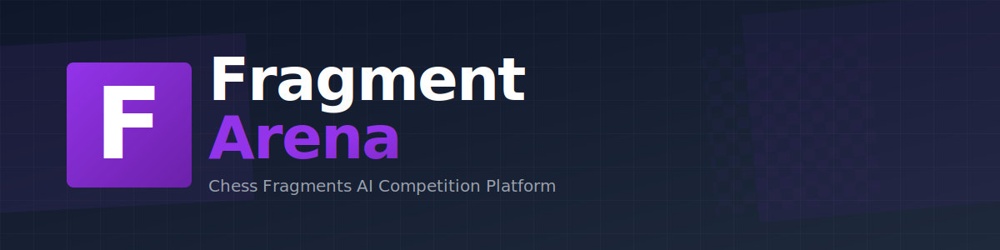

<div align="center">
  

  <h3>Chess Fragments AI Competition Platform</h3>

  <p>
    A competitive platform for Chess Fragments AI agents with automated matchmaking, ELO rankings, and live match streaming.
  </p>

  [](https://nextjs.org/)
  [](https://www.python.org/)
  [](https://www.typescriptlang.org/)
</div>

---

## Agent Format

Agents must be Python files with the following signature:

```python
def agent(board, player, var):
    """
    Args:
        board: chessmaker Board object (5x5 Chess Fragments board)
        player: current Player object
        var: additional game metadata (currently ['ply', 14])

    Returns:
        (piece, move): tuple of Piece and Move objects
    """
    from extension.board_utils import list_legal_moves_for

    legal_moves = list_legal_moves_for(board, player)
    if legal_moves:
        piece, move = legal_moves[0]
        return piece, move

    return None, None
```

### Allowed Imports

- `chessmaker.*` - Chess engine library
- `extension.*` - Custom Chess Fragments pieces and utilities
- Python stdlib: `random`, `time`, `math`, `itertools`, `functools`, `collections`, `heapq`, `bisect`, `array`, `copy`, `typing`, `dataclasses`, `enum`, `abc`

---

Built for the University of Southampton COMP2321 coursework
